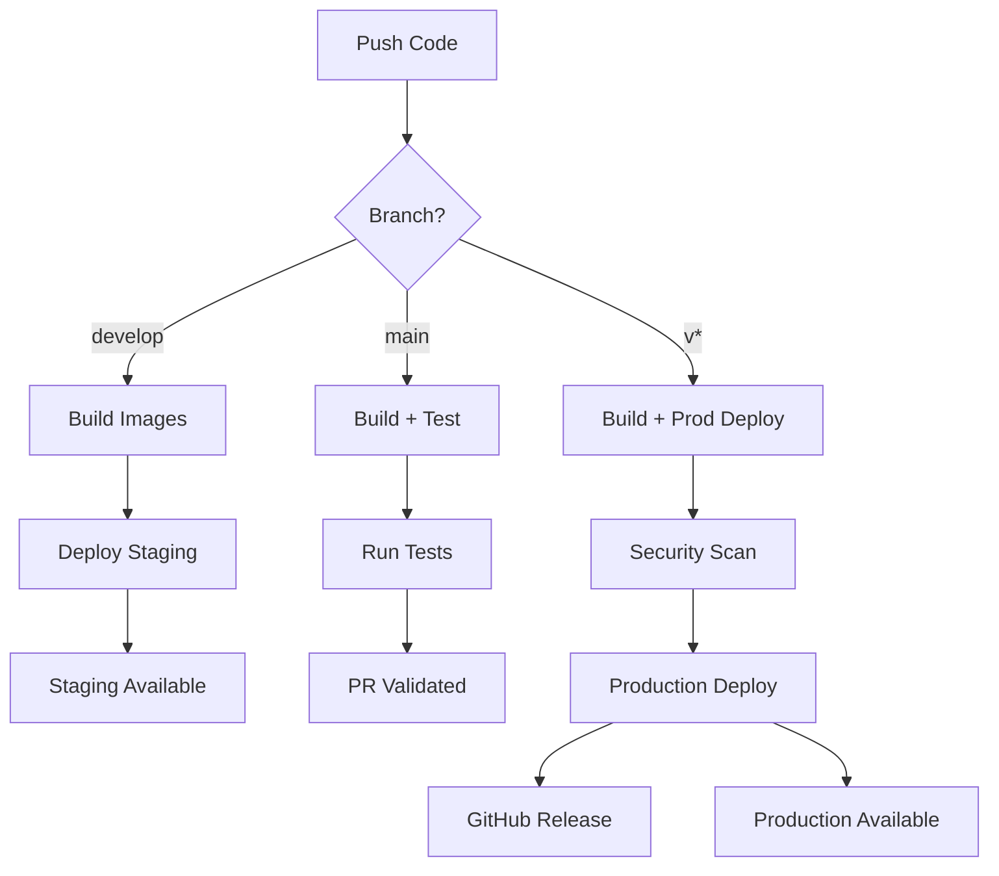

# 🔢 Classification MNIST - Application Complète

Une application de reconnaissance de chiffres manuscrits avec interface web interactive et API REST.

## 📊 Architecture Générale

```
┌─────────────────┐    HTTP     ┌─────────────────┐    Import    ┌─────────────────┐
│   Frontend      │ ─────────→  │    Backend      │ ─────────→   │     Modèle      │
│   Streamlit     │             │    FastAPI      │              │     PyTorch     │
│   (Port 8501)   │             │   (Port 8000)   │              │   (ConvNet)     │
└─────────────────┘             └─────────────────┘              └─────────────────┘
        │                               │                               │
        │                               │                               │
   Canvas Drawing ──────────────→ Prediction API ──────────────→ Neural Network
   User Interface                  REST Endpoints                  MNIST Classifier
```

## 🧠 1. Modèle Neural Network (`src/model/main.py`)

### **Rôle**
Ce fichier contient l'entraînement du réseau de neurones convolutionnel pour la classification MNIST.

### **Architecture ConvNet**
```python
class ConvNet(nn.Module):
    def __init__(self, input_size, n_kernels, output_size):
        self.net = nn.Sequential(
            # Couche 1: Conv2D (1→6 canaux) + ReLU + MaxPool
            nn.Conv2d(in_channels=1, out_channels=n_kernels, kernel_size=5),
            nn.ReLU(),
            nn.MaxPool2d(kernel_size=2),
            
            # Couche 2: Conv2D (6→6 canaux) + ReLU + MaxPool  
            nn.Conv2d(in_channels=n_kernels, out_channels=n_kernels, kernel_size=5),
            nn.ReLU(), 
            nn.MaxPool2d(kernel_size=2),
            
            # Aplatissement et couches fully connected
            nn.Flatten(),
            nn.Linear(in_features=n_kernels * 4 * 4, out_features=50),
            nn.ReLU(),
            nn.Linear(in_features=50, out_features=output_size)  # 10 classes
        )
```

### **Processus d'Entraînement**
1. **Chargement données** : MNIST via torchvision
2. **Normalisation** : Moyenne=0.1307, Std=0.3081 (standard MNIST)
3. **Permutation pixels** : `perm = torch.randperm(784)` pour augmenter la difficulté
4. **Optimisation** : AdamW optimizer
5. **Sauvegarde** : Modèle + permutation + métadonnées dans `models/convnet.pt`

### **Particularité : Permutation des Pixels**
```python
# Pendant l'entraînement
data_flattened = data.view(batch_size, -1)     # 28x28 → 784 pixels
data_permuted = data_flattened[:, perm]        # Réorganiser les pixels
data_reshaped = data_permuted.view(batch_size, 1, 28, 28)  # Retour 28x28
```

**Pourquoi ?** Cela force le modèle à apprendre des patterns plus robustes, pas juste la position des pixels.

### **Format de Sauvegarde**
```python
model_data = {
    'model_state_dict': convnet.state_dict(),  # Poids du réseau
    'permutation': perm,                       # Permutation utilisée
    'n_kernels': 6,                           # Architecture
    'input_size': 1,
    'output_size': 10
}
```

---

## 🚀 2. API Backend (`src/app/main.py`)

### **Rôle**
API REST FastAPI qui expose le modèle entraîné pour faire des prédictions.

### **Endpoints**
```
GET  /              → Informations sur l'API
POST /api/v1/predict → Prédiction d'image (upload fichier)
GET  /docs          → Documentation Swagger automatique
```

### **Chargement du Modèle**
```python
# Chargement intelligent avec rétrocompatibilité
checkpoint = torch.load(model_path, map_location=device)

if isinstance(checkpoint, dict) and 'model_state_dict' in checkpoint:
    # Nouveau format (avec permutation)
    permutation = checkpoint.get('permutation', torch.randperm(784))
    model.load_state_dict(checkpoint['model_state_dict'])
else:
    # Ancien format (sans permutation) 
    model.load_state_dict(checkpoint)
    permutation = torch.randperm(784)  # Aléatoire !
```

### **Pipeline de Prédiction**
```python
def preprocess_image(image_bytes) -> torch.Tensor:
    # 1. Décodage image
    image = Image.open(io.BytesIO(image_bytes))
    
    # 2. Conversion niveaux de gris + redimensionnement 28x28
    image = image.convert('L').resize((28, 28))
    
    # 3. Normalisation [0,255] → [0,1]
    image_array = np.array(image, dtype=np.float32) / 255.0
    
    # 4. Inversion couleurs si nécessaire (MNIST = fond noir)
    if image_array.mean() > 0.5:
        image_array = 1.0 - image_array
    
    # 5. Normalisation MNIST (μ=0.1307, σ=0.3081)
    image_array = (image_array - 0.1307) / 0.3081
    
    # 6. Application de la MÊME permutation que l'entraînement
    image_tensor = torch.from_numpy(image_array.flatten())
    image_permuted = image_tensor[permutation]  # CRUCIAL !
    image_reshaped = image_permuted.view(1, 28, 28)
    
    return image_reshaped
```

### **Sécurité**
- **Validation modèle** : Refuse de démarrer sans modèle entraîné
- **Gestion erreurs** : Try/catch pour les uploads malformés
- **Types stricts** : FastAPI avec validation automatique

---

## 🎨 3. Interface Frontend (`src/app/streamlit_app.py`)

### **Rôle** 
Interface web interactive permettant de dessiner des chiffres et obtenir des prédictions en temps réel.

### **Composants Principaux**

#### **Canvas de Dessin**
```python
canvas_result = st_canvas(
    fill_color="rgba(255, 255, 255, 0.0)",  # Transparent
    stroke_width=20,                        # Trait épais
    stroke_color="#000000",                 # Noir
    background_color="#FFFFFF",             # Fond blanc
    width=280, height=280,                  # Grande taille
    drawing_mode="freedraw",
    key="canvas"
)
```

#### **Preprocessing en Temps Réel**
```python
# Conversion automatique RGBA → Grayscale → 28x28
img = Image.fromarray(canvas_result.image_data.astype('uint8'), 'RGBA')
img_gray = img.convert('L')
img_resized = img_gray.resize((28, 28), Image.LANCZOS)
```

#### **Communication avec l'API**
```python
# Configuration flexible (Docker-ready)
API_URL = os.getenv("API_URL", "http://localhost:8000/api/v1/predict")

# Upload et prédiction
files = {"file": img_bytes}
response = requests.post(API_URL, files=files, timeout=10)
```

### **Visualisations**
- **Métrique principale** : Chiffre prédit + confiance
- **Graphique barres** : Probabilités des 10 classes
- **Détails expandable** : Probabilités exactes avec barres de progression
- **Monitoring API** : Statut de connexion en temps réel

### **Gestion d'Erreurs**
```python
try:
    response = requests.post(API_URL, files=files, timeout=10)
    # Traitement réussi
except requests.exceptions.ConnectionError:
    st.error("❌ Impossible de se connecter à l'API")
except Exception as e:
    st.error(f"❌ Erreur: {str(e)}")
```

---

## 🐳 4. Dockerisation

### **Architecture Multi-Conteneurs**
```yaml
services:
  backend:      # API FastAPI
    ports: ["8000:8000"]
    volumes: ["./models:/app/models"]
    
  frontend:     # Interface Streamlit  
    ports: ["8501:8501"]
    environment: ["API_URL=http://backend:8000/api/v1/predict"]
    depends_on: [backend]
```

### **Backend Dockerfile**
```dockerfile
FROM python:3.11-slim
WORKDIR /app

# Installation dépendances
COPY requirements.txt .
RUN pip install --no-cache-dir -r requirements.txt

# Code source
COPY src/ ./src/

# Modèles (avec fallback si vide)
RUN mkdir -p ./models
COPY models/ ./models/

# Configuration Python
ENV PYTHONPATH=/app/src
ENV PYTHONUNBUFFERED=1

# Lancement
CMD ["uvicorn", "src.app.main:app", "--host", "0.0.0.0", "--port", "8000"]
```

### **Frontend Dockerfile**
```dockerfile
FROM python:3.11-slim
WORKDIR /app

# Installation + app Streamlit
COPY requirements.txt .
RUN pip install --no-cache-dir -r requirements.txt
COPY src/app/streamlit_app.py ./

# Configuration Streamlit
ENV STREAMLIT_SERVER_PORT=8501
ENV STREAMLIT_SERVER_ADDRESS=0.0.0.0

# Lancement
CMD ["streamlit", "run", "streamlit_app.py", "--server.port=8501", "--server.address=0.0.0.0"]
```

---

## 🔄 Flux de Données Complet

```
1. [Utilisateur] Dessine un chiffre dans le canvas Streamlit
                 ↓
2. [Frontend] Convertit le dessin en image 28x28 pixels
                 ↓
3. [Frontend] Envoie POST /api/v1/predict avec l'image
                 ↓
4. [Backend] Reçoit l'image et applique le preprocessing :
   • Normalisation MNIST
   • Application de la permutation sauvegardée
                 ↓
5. [Backend] Passe l'image dans le modèle ConvNet
                 ↓
6. [Backend] Retourne JSON avec prédiction + probabilités
                 ↓
7. [Frontend] Affiche résultats avec visualisations
```

---

## 🚀 Utilisation

### **Entraînement**
```bash
python train_model.py                    # 10 epochs, sauvegarde dans models/
```

### **Mode Développement**
```bash
# Terminal 1 - API
uvicorn src.app.main:app --reload --host 0.0.0.0 --port 8000

# Terminal 2 - Frontend  
streamlit run src/app/streamlit_app.py
```

### **Mode Production (Docker)**
```bash
docker compose up --build              # Build + lancement
# Frontend: http://localhost:8501
# Backend:  http://localhost:8000
```

---

## 🤖 CI/CD avec GitHub Actions

### **Pipeline Automatique**

Le workflow `.github/workflows/docker.yml` automatise complètement le processus :

```yaml
on:
  push:
    branches: [ main, develop ]    # Auto-build sur push
    tags: [ 'v*' ]                # Production sur tags
  pull_request:
    branches: [ main ]            # Tests sur PR
```

### **Stratégie de Déploiement**

#### 🟡 **Staging** (branche `develop`)
- **Déclencheur** : Push sur `develop`
- **Images** : `ghcr.io/owner/repo/mnist-{frontend,backend}:develop`
- **URL** : `http://localhost:8511` (frontend), `http://localhost:8010` (backend)

#### 🟢 **Production** (tags `v*`)
- **Déclencheur** : Tags de version (ex: `v1.0.0`)
- **Images** : `ghcr.io/owner/repo/mnist-{frontend,backend}:v1.0.0`
- **URL** : `http://localhost:8501` (frontend), `http://localhost:8000` (backend)
- **Release** : Création automatique de GitHub Release

### **Registry d'Images**

Les images sont automatiquement publiées sur **GitHub Container Registry** :

```bash
# Images disponibles
docker pull ghcr.io/owner/repo/mnist-frontend:latest
docker pull ghcr.io/owner/repo/mnist-backend:latest
docker pull ghcr.io/owner/repo/mnist-frontend:v1.0.0
docker pull ghcr.io/owner/repo/mnist-backend:v1.0.0
```

### **Déploiement Manuel**

#### **Script de Déploiement**
```bash
# Staging
./deploy.sh staging develop

# Production  
./deploy.sh production v1.0.0
./deploy.sh production latest
```

#### **Docker Compose Direct**
```bash
# Staging
export GITHUB_REPOSITORY="owner/repo"
export VERSION="develop"
docker-compose -f docker-compose.staging.yml up -d

# Production
export GITHUB_REPOSITORY="owner/repo" 
export VERSION="v1.0.0"
docker-compose -f docker-compose.prod.yml up -d
```

### **Sécurité & Monitoring**

#### **Scan de Vulnérabilités**
- **Trivy** scan automatique des images
- **SARIF** upload vers GitHub Security
- **Bloquant** pour les déploiements production

#### **Health Checks**
```yaml
healthcheck:
  test: ["CMD", "curl", "-f", "http://localhost:8000/"]
  interval: 30s
  timeout: 10s
  retries: 3
```

#### **Utilisateurs Non-Root**
```dockerfile
RUN groupadd -r appuser && useradd -r -g appuser appuser
USER appuser
```

### **Workflow Complet**



### **Variables d'Environnement**

Pour configurer votre déploiement, créez ces secrets GitHub :

```bash
# GitHub Repository Settings > Secrets
REGISTRY_USERNAME=your-github-username
REGISTRY_PASSWORD=your-github-token  # Avec permissions packages:write

# Pour déploiements automatiques (optionnel)
DEPLOY_SSH_KEY=your-production-ssh-key
PRODUCTION_HOST=your-server.com
STAGING_HOST=staging.your-server.com
```

---

## 🔍 Points Techniques Avancés

### **Permutation des Pixels**
- **Problème** : Sans permutation, le modèle apprend juste la position des pixels
- **Solution** : Mélanger l'ordre des pixels force à apprendre des features plus robustes
- **Implémentation** : `perm = torch.randperm(784)` appliqué de manière identique train/test/prod

### **Normalisation Multi-Étapes**
1. **[0,255] → [0,1]** : Division par 255
2. **Inversion couleurs** : `1.0 - image` si fond blanc détecté
3. **Standardisation MNIST** : `(x - 0.1307) / 0.3081`

### **Gestion États**
- **Modèle** : Chargé une fois au démarrage de l'API
- **Permutation** : Sauvegardée avec le modèle pour cohérence
- **Session** : Streamlit maintient l'état du canvas entre interactions

### **Robustesse**
- **API** : Refuse de démarrer sans modèle valide
- **Frontend** : Détection automatique de l'état de l'API
- **Docker** : Healthchecks et restart policies
